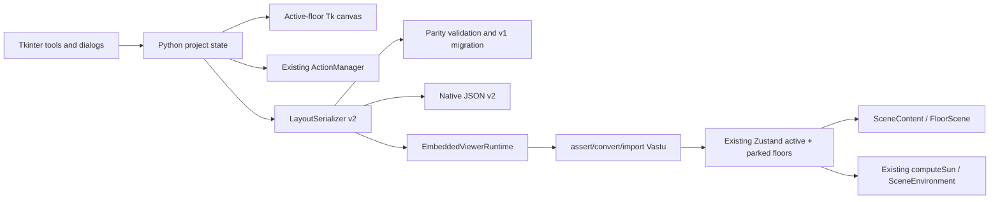

# Design Document

## Overview

This design adds Home Quest feature parity to the Python/Tkinter editor without replacing either application's existing architecture. Tkinter remains the authoring application and persists one versioned native document. Home Quest remains the authority for canonical entity meanings, conversion into centimeters, Zustand floor storage, sun computation, and 3D rendering.

The central change is to evolve the Python native document from the single-floor `1.0` shape into a `2.0` project containing floor metadata, isolated geometry for every floor, finish identifiers, structural entities, project-level sun settings, and explicit cross-floor references. The active floor alone is materialized on the Tk canvas. Other floors remain parked as serializable native geometry, matching Home Quest's existing active/parked floor model.

### Goals

- Add wall/floor painting, floor lifecycle management, pillars, beams, deck slabs, and sun controls to Tkinter.
- Preserve old native layouts through in-memory `1.0` to `2.0` migration.
- Keep one persisted native document and one existing Home Quest renderer.
- Make every mutation atomic for validation, undo/redo, autosave, and viewer synchronization.
- Reject invalid data before replacing editor or viewer state.

### Non-goals

- A second 3D renderer or an intermediate `.hq.json` file.
- New Tkinter authoring for stairs, railings, roads, or cloud collaboration.
- Reworking Home Quest floor/entity semantics.
- Fixing the separate stale `EdgeChrome` compatibility issue.

## Architecture



### Architectural decisions

1. **The project model, not the canvas, owns parity state.** The canvas is a view of one active floor. This prevents hidden floors from being encoded as invisible canvas items and makes switching lossless.
2. **Use the existing active/parked-floor pattern.** Before a switch, serialize the active canvas into its floor geometry; then materialize the selected parked geometry. The viewer receives all floors and Home Quest loads the selected one into its live maps while parking the others in `floorData`.
3. **Use schema version `2.0`.** Version `1.0` remains readable. Unsupported major versions are rejected before mutation. Migration occurs in memory and is written only on the next successful save.
4. **Keep Home Quest semantics authoritative.** Python stores canonical identifiers and fields, but `importVastu.ts`, existing Zustand slices, material services, `computeSun`, `SceneContent`, and `FloorScene` decide web behavior.
5. **Send complete snapshots.** Viewer updates remain direct, request-ID ordered, and atomic. Incremental entity messaging would add a second synchronization protocol and is unnecessary for the stated capacity.
6. **Extend the existing history manager.** Do not add another undo stack. Parity actions carry floor ownership plus before/after data sufficient to reverse exactly.

## Components and Interfaces

### Python project state and floor manager

Add a small project-state owner beside the existing model. It stores:

- ordered floor descriptors;
- active floor ID;
- parked native geometry keyed by floor ID;
- project-level sun settings;
- cross-floor references;
- current schema version.

A floor manager exposes `add`, `duplicate`, `activate`, `rename`, `set_elevation`, and `delete`. Each public operation follows one transaction:

1. Build a proposed copy without touching the canvas or current project.
2. Validate IDs, elevations, references, entity values, and limits.
3. Record one undo action containing before/after state and floor ownership.
4. Commit project state and materialize the active floor if it changed.
5. Schedule autosave and one debounced viewer update.

Floor switching snapshots the outgoing canvas before loading the incoming floor and clears selection. Duplication deep-copies the active floor, creates fresh IDs, remaps intra-floor references, and intentionally excludes stairs, roads, annotations, and cross-floor references. Deletion remains disabled for the final floor and is blocked by unresolved cross-floor references.

### Native serializer, migration, and validation

`layout_serializer.py` remains the only save/load/export/import entry point. Its existing v1 serialization helpers are reused for the geometry inside each floor rather than replaced wholesale.

Loading is staged:

```text
read bytes -> parse JSON -> identify version -> structural validation
-> v1 migration if required -> semantic/reference validation
-> build temporary project -> replace current project and canvas
```

Saving is also staged: serialize a complete temporary document, validate it, write to a sibling temporary file, flush and close it, then atomically replace the target. Autosave and rotating backups call the same serializer so they cannot omit parity data.

The validator returns path-based issues such as `floors[1].geometry.beams[2].width_cm`. It checks supported version, file size, collection limits, globally unique IDs, finite/limited coordinates, positive dimensions, floor elevation uniqueness, material IDs, polygon validity, and all intra-/cross-floor references.

### Tkinter tools and UI

Reuse the current toolbar/tab and dialog patterns:

- **Paint tool:** finish palette plus target mode (`wall base`, `wall side A`, `wall side B`, `room floor`, or `deck`). Hit testing resolves one semantic target, checks finish compatibility, then updates only that finish field.
- **Floor controls:** compact selector with Add, Duplicate, Rename, Elevation, and Delete actions. The ground floor elevation is read-only.
- **Pillar tool:** click to place; properties dialog edits position, footprint, height, base elevation, shape, and finish.
- **Beam tool:** two clicks define endpoints; properties dialog edits section dimensions, elevation, and finish.
- **Deck/slab tool:** polygon drawing reuses the existing polygon interaction; completion opens type, thickness, elevation, and finish properties.
- **Sun controls:** time slider, manual-direction checkbox, and azimuth slider. Controls edit project-level settings and do not create canvas items.

Semantic canvas tags contain entity and floor IDs. Structural items receive dedicated tags and minimal 2D symbols. Finish changes use existing texture/color drawing where possible; otherwise a deterministic hatch/tint and finish label distinguish non-default finishes without loading 3D materials into Tkinter.

### History and autosave

`ActionManager` gains parity action kinds rather than a parallel command framework. Small edits store the affected entity before and after. Floor add/duplicate/delete/switch-sensitive operations store the affected floor descriptors, geometry, references, and active-floor ID. Sun actions store old/new settings. Every action includes `floor_id` where applicable, so replay first verifies or restores the correct owning floor.

Undo and redo apply state without logging a second action, then rematerialize the active floor, refresh availability controls, schedule autosave, and synchronize the viewer. A new mutation after undo uses the existing redo clearing behavior.

### Finish catalog boundary

Python ships a lightweight, versioned finish manifest containing only canonical ID, label, supported surface categories, and a 2D swatch. It does not duplicate Three.js material construction. Home Quest's existing material service remains authoritative at import/render time. The importer reports an unavailable ID and uses its existing category-appropriate fallback; it never maps an unknown ID to a different semantic finish silently.

Compatibility is enforced at two points: Tkinter disables incompatible palette choices, and the import validator independently checks every target category because native files are untrusted.

### Embedded viewer and web import

`EmbeddedViewerRuntime.send_layout()` continues sending a complete serializer snapshot with a monotonically increasing request ID. A 250 ms Tk `after` debounce coalesces rapid slider or drag updates; explicit refresh bypasses the debounce. The retained WebView2 runtime, loopback asset server, Retry behavior, and stale-response rules remain unchanged.

`importVastu.ts` becomes version-dispatched while keeping its public validation/conversion/import boundary:

- v1 follows the current conversion path and yields one ground floor;
- v2 validates and converts every floor independently;
- conversion remains pure and returns a complete candidate project plus warnings;
- one store transaction installs `floors`, `activeFloorId`, active geometry maps, parked `floorData`, and sun settings only after all floors succeed.

The converter applies the existing pixel-to-centimeter formula, Y reflection, and one project-wide origin translation. A single translation for all floors is essential: normalizing each floor independently would misalign the building stack. Floor elevations and structural dimensions are interpreted in canonical centimeters; plan positions still follow native coordinate metadata.

The viewer does not gain new structural rendering code. Converted pillars, beams, and deck slabs populate the existing maps consumed by `FloorScene`. All floors continue through `SceneContent`. Imported sun values populate `viewerSlice`; `SceneEnvironment` continues using `computeSun` for light, shadows, sky, clock, and direction labels.

## Data Models

### Native document `2.0`

```json
{
  "version": "2.0",
  "metadata": {
    "unit": "feet",
    "unit_scale": 1,
    "grid_spacing": 20,
    "zoom_level": 1,
    "wall_height_cm": 280
  },
  "active_floor_id": "floor-ground",
  "floors": [
    {
      "id": "floor-ground",
      "name": "Ground Floor",
      "elevation_cm": 0,
      "geometry": {
        "vertices": [],
        "walls": [],
        "rooms": [],
        "openings": [],
        "furniture": [],
        "shapes": [],
        "text": [],
        "pillars": [],
        "beams": [],
        "deck_slabs": [],
        "railings": []
      }
    }
  ],
  "sun_settings": {
    "time_hours": 12,
    "azimuth_deg": 120,
    "direction_override": false
  },
  "cross_floor_references": []
}
```

Arrays are used on disk for stable ordering and readable validation paths; import converts them to ID-keyed maps. Existing v1 room, shape, furniture, text, compass, and metadata fields are preserved by migration. `railings` is retained for round-trip/duplication compatibility but has no new Tkinter authoring tool in this scope.

### Core records

```text
Floor = { id, name, elevation_cm, geometry }
Wall = { id, start_vertex_id, end_vertex_id, thickness_cm, height_cm,
         material_id, material_side_a?, material_side_b?, opening_ids[] }
Room = { id, boundary_vertex_ids[], label, room_type, floor_material_id, ... }
Pillar = { id, position, width_cm, depth_cm, height_cm, elevation_cm,
           shape: rect|round, material_id }
Beam = { id, start, end, width_cm, depth_cm, elevation_cm, material_id }
DeckSlab = { id, polygon[], thickness_cm, elevation_cm,
             type: corridor|balcony|landing|roof|custom, material_id }
SunSettings = { time_hours, azimuth_deg, direction_override }
CrossFloorReference = { id, type, source_floor_id, source_entity_id,
                         target_floor_id, target_entity_id }
```

All entity IDs are globally unique. Entity ownership is implied by the containing floor and checked against any stored `floor_id` canvas tag. Wall side A follows Home Quest's directed-wall positive normal `(dy, -dx)` after coordinate conversion; side B is the opposite face. This definition is explicit so Y reflection cannot swap painted faces accidentally.

### Version migration

The `1.0 -> 2.0` migration:

1. Creates one `Ground Floor` at elevation `0` with a fresh floor ID.
2. Moves all supported v1 geometry into that floor without changing source coordinates.
3. Preserves flooring through the existing flooring-to-canonical-finish map.
4. Builds explicit wall/room/opening records through the same inference rules already used by the Home Quest importer.
5. Preserves canvas-only supported shapes and text for Tkinter round trips.
6. Initializes structures, railings, and cross-floor references as empty.
7. Initializes sun settings to `12`, `120`, and override disabled.
8. Marks the in-memory project dirty only after successful migration; it does not rewrite the source file.

Migration functions are chained by source version so a later schema can add one adjacent migration instead of changing old migration behavior.

## Validation and geometry rules

- Names are trimmed and must remain non-empty.
- Ground floor elevation is exactly `0`; other elevations are finite, positive, and unique.
- Positions and dimensions are finite and within configured project bounds; positive dimensions are strictly greater than zero.
- Beam endpoints must differ after conversion tolerance.
- Deck polygons remove only a duplicated closing vertex, then require at least three distinct points, non-zero signed area, and no non-adjacent edge intersections.
- Azimuth is normalized with `((value % 360) + 360) % 360`; time is clamped/rejected according to the UI/load boundary, with serialized values required in `[0, 24]`.
- Finish IDs must exist and support the target surface category.
- Intra-floor references cannot escape their owner floor. Cross-floor links must use explicit cross-floor records and resolve both endpoints.
- Deletion first computes inbound references; blocking references produce an error and leave state unchanged.
- Viewer payload size and entity counts use the existing importer limits, expanded only through explicit per-project/per-floor constants.

## Correctness Properties

The implementation must preserve these invariants across generated and fixture-based checks:

### Property 1: Round-trip equivalence
For every valid v2 project `P`, loading `save(P)` produces a project equivalent to `P` apart from non-semantic JSON ordering.

**Validates: Requirements 10.5, 12.1, 12.2**

### Property 2: Migration preservation
Migrating any valid v1 project preserves every supported v1 room, shape, furniture item, window/opening inference, text item, flooring assignment, compass value, and unit/scale field on exactly one ground floor.

**Validates: Requirements 3.2, 10.2, 10.3, 10.4**

### Property 3: Floor isolation
Editing or repeatedly switching the active floor cannot change any unedited parked floor's entity count, IDs, values, or references.

**Validates: Requirements 3.5, 3.6, 4.3, 17.5**

### Property 4: Duplication integrity
A duplicated floor contains no reused entity IDs; every copied intra-floor reference resolves within the duplicate; every excluded entity/reference category is absent.

**Validates: Requirements 5.1, 5.2, 5.3, 14.2, 14.3**

### Property 5: Atomic rejection
If any proposed load, mutation, or viewer conversion fails validation, observable editor/store state equals its complete pre-operation state.

**Validates: Requirements 12.4, 12.5, 14.6, 16.1, 16.3**

### Property 6: Coordinate consistency
Every floor uses the same pixel-to-centimeter scale, Y reflection, and project-wide origin translation, preserving horizontal alignment across the 3D stack.

**Validates: Requirements 13.1, 13.2, 13.4, 15.5**

### Property 7: History inversion
Applying undo immediately after any accepted parity action restores the exact pre-action project; redo then restores the exact post-action project.

**Validates: Requirements 11.1, 11.2, 11.3, 11.5**

### Property 8: Finish-face stability
Converting a directed wall and reflecting Y preserves the documented Home Quest side-A/side-B physical faces.

**Validates: Requirements 2.1, 2.2, 2.3, 13.4**

### Property 9: Sun normalization
Every finite manual azimuth maps to `[0, 360)`, and disabling override delegates direction to the existing day-arc computation.

**Validates: Requirements 9.1, 9.2, 9.3, 9.4**

### Property 10: Newest-viewer-wins
For any completion order of viewer requests, the displayed project corresponds to the greatest successfully applicable request ID and never regresses to an older one.

**Validates: Requirements 15.3, 15.4, 16.3**

## Error Handling

| Failure | Behavior |
|---|---|
| Invalid tool input | Keep the previous entity/project and focus the failing field. |
| Invalid load or unsupported version | Keep current project/canvas; report JSON path and reason. |
| Save/write failure | Keep previous target via temporary-file replacement; report the OS error. |
| Viewer conversion failure | Keep the last successful Zustand project and scene; return request-scoped error. |
| Out-of-order viewer result | Ignore any result older than the newest successful/requested applicable ID. |
| Render process failure | Keep all 2D, persistence, and history operations available; expose Retry. |
| Unavailable finish/entity | Preserve source identifier in warnings; never silently substitute another semantic entity. |

## Performance strategy

- Park floors as plain serializable records; only materialize one floor's Tk items.
- Batch canvas recreation with redraw suppression and return control to Tk between bounded chunks for large floors.
- Deep-copy and remap a duplicated floor in memory before one canvas commit.
- Debounce viewer snapshots by 250 ms and serialize once per accepted mutation burst.
- Retain one embedded runtime and one static server.
- Keep validation linear in entity/reference count except deck self-intersection, which is intentionally an O(n²) check suitable for interactively drawn polygons; upgrade to a sweep-line algorithm only if measured deck vertex counts require it.

## Testing Strategy

Implementation should leave the smallest runnable checks at each non-trivial boundary.

### Python checks

- v1 fixture migrates to one ground floor and round-trips as v2.
- v2 multi-floor fixture round-trips without changing IDs, geometry, finishes, elevations, structures, sun, or references.
- Future versions and invalid values fail before current project replacement.
- Add/switch/duplicate/delete preserve isolated floor geometry and apply ID remapping/exclusions.
- Undo/redo restores exact before/after project snapshots on the owning floor.
- Beam and deck geometry validation covers zero length, zero area, and self-intersection.
- Serializer save failure leaves the previous target unchanged.

### Web checks

- Existing v1 importer tests remain unchanged and passing.
- v2 conversion produces active maps plus parked `floorData` with one shared origin translation.
- Per-face wall finishes retain side A/B after Y reflection.
- Structures map directly to existing canonical entity fields.
- An invalid floor prevents the entire Zustand replacement.
- Request ordering rejects stale success/failure responses.
- Imported sun settings drive the existing viewer slice and `computeSun` path.

### Integration and manual checks

- Compile changed Python modules and run targeted importer/store tests plus the production build.
- Create, duplicate, rename, elevate, switch, and delete floors while checking the 2D canvas and whole-building 3D stack.
- Paint every supported surface, edit each structural type, and verify save/load/undo/redo/autosave.
- Exercise 20 floor switches and 20 Plan/Viewer switches without state drift or extra runtimes.
- Kill the rendering process, continue editing/saving, Retry, and verify the newest complete project appears.

## Implementation order

1. Define v2 records, validation, migration, and serializer round-trip while leaving v1 behavior intact.
2. Add Python project/floor state and adapt active-canvas materialization.
3. Extend the web importer for atomic v2 multi-floor/store/sun hydration.
4. Add floor UI and lifecycle/history integration.
5. Add finish manifest and paint operations.
6. Add pillar, beam, and deck tools using shared validation/transaction paths.
7. Add sun controls and debounced viewer synchronization.
8. Harden error paths, limits, performance, and end-to-end compatibility.

This order makes persisted data and the import contract stable before UI tools can create it, reducing the risk of unsavable editor state.

## Requirements traceability

| Requirement | Design coverage |
|---|---|
| 1. Architecture/reuse | Architecture decisions; embedded viewer/web import |
| 2. Finishes | Finish catalog boundary; Paint tool; wall-face definition |
| 3. Floor creation | Project state/floor manager; v1 migration |
| 4. Floor switching/elevation | Floor manager transaction and validation rules |
| 5. Duplicate/delete safeguards | Floor manager copy/remap/exclusion/reference behavior |
| 6. Pillars | Core records; Pillar tool; shared validation |
| 7. Beams | Core records; Beam tool; geometry validation |
| 8. Deck/slabs | Core records; Deck tool; polygon validation |
| 9. Sun | Sun controls; viewer slice and `computeSun` reuse |
| 10. Schema evolution | Native document v2; staged migration and version dispatch |
| 11. Undo/redo | Existing ActionManager parity action kinds |
| 12. Persistence/autosave | Atomic serializer and shared autosave path |
| 13. Units | Existing metadata formula, canonical dimensions, shared origin |
| 14. Validation/references | Validator staging and geometry/reference rules |
| 15. Viewer synchronization | Complete snapshots, debounce, request ordering, atomic import |
| 16. Recovery | Failure handling table and Retry behavior |
| 17. Responsiveness | Performance strategy and capacity checks |
| 18. Scope | Goals/non-goals and implementation boundaries |
