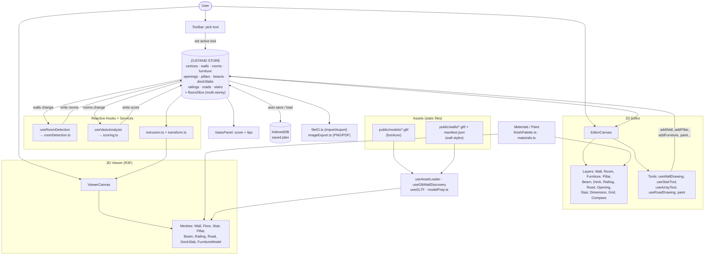

# Home Quest — Architecture

Client-side only. No backend. Everything runs in the browser.
Diagram renders in GitHub / VS Code Mermaid preview — **click it to zoom & pan.**

**Rule:** components never talk to each other directly. They all read/write the **Store**. Data flows one way: UI action → Store → logic reacts → Store → UI re-renders. Assets are static files under `public/`, loaded on demand into the 3D meshes. IndexedDB is the only persistence.
