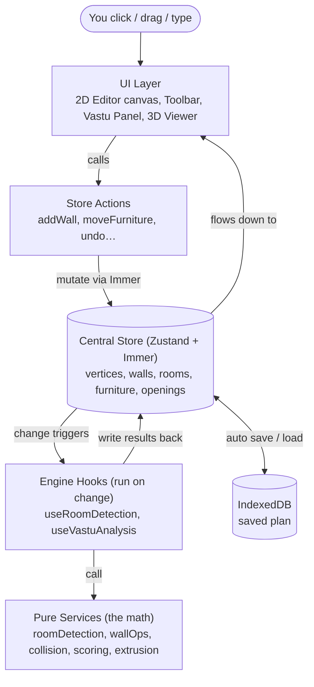

# Home Quest — Architecture & Interview Study Guide

> A from-scratch, beginner-friendly explanation of every part of this project, written so you can understand it deeply and explain it out loud in an interview.
>
> **How to read this doc:** Start at the top and go in order. Every technical term is explained in plain English the first time it appears. The most important sections for you are **6. Feature-by-Feature Deep Dive** (the logic) and the **DSA + Math** call-outs inside them.

---

## Table of Contents

1. [Project Overview](#1-project-overview)
2. [Tech Stack (explained)](#2-tech-stack-explained)
3. [High-Level Architecture](#3-high-level-architecture)
4. [Folder & Module Map](#4-folder--module-map)
5. [State Management & Data Flow](#5-state-management--data-flow)
6. [Feature-by-Feature Deep Dive](#6-feature-by-feature-deep-dive)
7. [System Design Perspective](#7-system-design-perspective)
8. [Likely Interview Questions](#8-likely-interview-questions)
9. [Glossary](#9-glossary)
10. [Honest Notes & Known Rough Edges](#10-honest-notes--known-rough-edges)

---

## 1. Project Overview

**Home Quest is a web app where you draw a 2D floor plan, watch it turn into a 3D house in real time, and get an automatic "Vastu" score that tells you whether each room is placed in an auspicious direction.**

- **What it is:** A browser-based floor-plan editor + 3D walkthrough + Vastu (a traditional Indian system of architecture) analyzer, all in one screen.
- **Who it's for:** Homebuilders, architects, and interior designers who want to check a layout against Vastu rules *before* building.
- **The core problem it solves:** Checking Vastu by hand needs fiddly geometry — finding the true center of an odd-shaped house, slicing it into a 3×3 grid, and figuring out which "compass zone" each room sits in. Home Quest does all that math automatically as you draw, and shows the result in both 2D and 3D.

---

## 2. Tech Stack (explained)

Everything below is taken from `package.json`.

### Core libraries (ship in the final app)

| Tool | What it is (plain English) | Why this project uses it |
|------|----------------------------|--------------------------|
| **React 19** | A library for building user interfaces out of reusable "components" (self-contained pieces of UI). | The whole UI — toolbar, canvas, panels — is made of React components. |
| **TypeScript** | JavaScript with *types* — you declare that something is a `number` or a `Point2D`, and the editor catches mistakes before you run the code. | This app is full of geometry math; types stop bugs like passing a string where a coordinate is expected. |
| **Zustand 5** | A small "global memory" (state-management) library. Think of it as one shared box of data any component can read from or write to. | The 2D editor and 3D viewer must share the same walls/rooms data. Zustand holds that shared data. |
| **Immer** | A helper that lets you *write* code as if you're directly editing data, but secretly makes a safe copy instead. | Updating deeply nested data (like `walls[id].thickness`) becomes simple and safe (no accidental shared edits). |
| **Three.js** | The standard library for 3D graphics in the browser (it talks to the GPU via WebGL). | Renders the 3D house: walls, floors, windows, furniture. |
| **React Three Fiber (R3F)** | Lets you write Three.js 3D scenes using React components (`<mesh>`, `<group>`) instead of manual Three.js code. | Keeps the 3D scene declarative and consistent with the rest of the React app. |
| **@react-three/drei** | A toolbox of ready-made R3F helpers (camera controls, loaders, stats). | Provides `OrbitControls` (drag-to-orbit camera), `<Stats>` FPS meter, etc. |
| **idb-keyval** | A tiny wrapper around **IndexedDB** (the browser's built-in database). | Saves your floor plan on your own computer so it survives a page refresh — no server needed. |
| **lucide-react** | A set of clean SVG icons as React components. | Toolbar and UI icons. |

### Dev / build tools (used while developing, not shipped as-is)

| Tool | What it is | Why |
|------|-----------|-----|
| **Vite 8** | A build tool + dev server with near-instant reloads. | Fast local development and the production build (`vite build`). |
| **Tailwind CSS 4** | A styling system where you add tiny utility classes (`flex`, `h-12`) right in the markup. | Quick, consistent styling without separate CSS files. |
| **Vitest 4** | A unit-test runner (runs small tests on individual functions). | For testing pure logic like geometry. |
| **Testing Library** | Helpers to test React components the way a user sees them. | Component tests. |
| **Playwright** | A browser automation tool used here for **visual regression** (screenshot comparison) testing. | Catches accidental visual changes (`tests/visual/`). |
| **Storybook 10** | A sandbox to develop and view components in isolation. | Component development/preview. |
| **ESLint** | A linter — flags suspicious or non-standard code. | Code quality. |

**Path alias:** `@/` means `src/` (configured in `vite.config.ts`). So `@/store` = `src/store`.

---

## 3. High-Level Architecture

The app has **one shared data store** in the middle, and everything talks through it. Nothing draws directly into another part's territory — the 2D editor never touches 3D code, and vice-versa. This is called **separation of concerns**.



### The flow in plain English (one full loop)

1. You pick the **Wall tool** and click twice on the 2D canvas.
2. The canvas component (`EditorCanvas.tsx`) converts your screen clicks into world coordinates and calls the store action `addWall`.
3. The store updates `vertices` and `walls` (the raw geometry).
4. Because `walls` changed, two **engine hooks** wake up automatically:
   - `useRoomDetection` recomputes which loops of walls form enclosed **rooms**.
   - `useVastuAnalysis` recomputes the house outline + the **Vastu score**.
   - Both write their results back into the store.
5. The **3D viewer**, which is always reading the store, sees the new walls and builds 3D meshes for them.
6. The store also auto-saves the plan to **IndexedDB** so it's still there after a refresh.

**Key idea:** Data flows *one way* (down). Components don't talk to each other directly; they all read/write the one store. That's why you can change the 3D engine without touching the 2D editor.

---

## 4. Folder & Module Map

```
src/
├── main.tsx                  App entry point (mounts React into the page)
├── App.tsx                   CURRENT root: shows the Sandbox dev harness
├── app/
│   ├── App.tsx               PRODUCTION 3-pane shell (Editor | Viewer | Vastu) — see note in §10
│   ├── ErrorBoundary.tsx     Catches crashes so the whole app doesn't die
│   ├── fallbacks/            "Something broke" UI for each pane
│   ├── hooks/                App-wide hooks (keyboard shortcuts, responsive layout, a11y)
│   └── SandboxView.tsx       Manual testing playground
├── store/                    THE BRAIN (Zustand)
│   ├── index.ts              Builds the store from all slices + persistence
│   ├── slices/               Each slice = one topic of state + its actions
│   │   ├── editorSlice.ts    Floor-plan data + geometry mutations (addWall, etc.)
│   │   ├── uiSlice.ts        Which tool/panel is active (transient UI)
│   │   ├── viewerSlice.ts    3D camera mode, render quality
│   │   ├── vastuSlice.ts     Vastu overlay toggles + computed score
│   │   ├── settingsSlice.ts  Feature flags, dev mode, active view
│   │   └── historySlice.ts   Undo / redo (snapshot-based)
│   ├── history/              Snapshot helpers (+ an UNUSED command-pattern attempt)
│   ├── persistence/          Save/load: IndexedDB, migrations, validation, file import/export
│   ├── guards/               Validity checks (reject bad walls, repair broken graphs)
│   └── selectors/            Memoized "views" of the store for components
├── domains/                  The features, split into isolated areas
│   ├── editor/               2D drawing (components, hooks, services)
│   ├── viewer/               3D rendering (components, hooks, services)
│   ├── vastu/                Vastu scoring (components, hooks, services)
│   └── shared/               UI used everywhere (Toolbar, EmptyState, a11y helpers)
├── types/                    Shared TypeScript type definitions
│   ├── geometry.ts           Point2D, Point3D, AABB, OBB, ViewTransform
│   └── editor.ts             Vertex, Wall, Room, FurnitureItem, Opening
└── utils/                    id generator, error classes, event bus, env helpers
```

**Domain rule:** Each domain exposes a **public API** through a `services/index.ts` "barrel" file. Other code imports from the barrel, not from deep inside. This keeps domains swappable.

---

## 5. State Management & Data Flow

### The core data model (the "objects" the app works with)

These live in `src/types/editor.ts` and `src/types/geometry.ts`. The floor plan is stored as a **graph** — dots (vertices) connected by lines (walls).

```
Point2D   { x, y }                         a point, in centimeters
Vertex    { id, position: Point2D,         a dot where walls meet
            connectedWalls: id[] }          (knows which walls touch it)
Wall      { id, startVertexId, endVertexId, a line between two vertices
            thickness, height, materialId,
            isLoadBearing, openingIds: id[] }
Room      { id, boundaryVertexIds: id[],    an enclosed loop of vertices
            roomType, label, floorMaterialId }
Opening   { id, wallId, type,               a door/window/vent cut into a wall
            offsetCm, width, height, elevation }
FurnitureItem { id, position, rotation,     a placed piece of furniture
            scale, catalogId, roomId, bounds }
```

### Why store data as "normalized maps" instead of arrays?

The store keeps walls as `Record<id, Wall>` — a **hash map / dictionary** keyed by id — *not* a list/array.

- **Lookup by id is O(1)** (instant): `walls["wall_123"]`. With an array you'd loop through every wall to find one — **O(n)**.
- Updating, deleting, and referencing-by-id (like a "foreign key" in a database) are all O(1).
- **Trade-off:** To draw everything, you call `Object.values(walls)` to get a list — that's O(n), but you'd pay that with an array too. The win is in targeted edits, which happen constantly.

> A `Wall` stores `startVertexId`/`endVertexId` (ids), not the vertex objects themselves. This is **normalization** (one source of truth). Move the vertex once, and every wall connected to it follows — no duplicated/stale copies.

### How the store is built — `src/store/index.ts`

The store is assembled from six **slices** (each slice = one topic). Three pieces of **middleware** (wrappers that add behavior) are layered on:

```
create()(  devtools(  persist(  immer(  ...all slices...  )  )  )  )
```

- **`immer`** — lets each action write `state.walls[id].thickness = 20` directly; Immer turns that into a safe immutable update behind the scenes.
- **`persist`** — automatically saves part of the state to storage and reloads it on startup.
- **`devtools`** — lets you inspect state changes in the Redux DevTools browser extension.

**What gets saved** (the `partialize` option): only the *floor-plan data* — `vertices, walls, rooms, furniture, openings`. UI state (active tool) and history (undo stacks) are **transient** and intentionally not saved.

### The slices at a glance

| Slice | Holds | Example actions |
|-------|-------|-----------------|
| `editorSlice` | the actual geometry | `addWall`, `removeWall`, `moveVertex`, `addFurniture`, `addOpening`, `scalePlan`, `clearAll` |
| `uiSlice` | active tool, panel visibility, chain mode, dimensions toggle | `setActiveTool`, `togglePanel` |
| `viewerSlice` | camera mode (orbit/first-person), render quality, 3D centroid | `setCameraMode`, `setPlanCentroid3D` |
| `vastuSlice` | overlay toggles, plan boundary, computed score | `setVastuScore`, `setPlanBoundary` |
| `settingsSlice` | feature flags, dev mode, `activeView` | `setActiveView`, `toggleFeatureFlag` |
| `historySlice` | undo/redo flags + the record/undo/redo logic | `recordHistory`, `undo`, `redo` |

### Selectors — `src/store/selectors/editorSelectors.ts`

Components don't read raw walls; they use **selectors** — small functions that compute a convenient, *memoized* view. **Memoized** means "remembers the last result and only recomputes when inputs actually change," which avoids needless work and re-renders.

- `useWallSegments()` → walls turned into `{start, end, thickness, offsets}` for 2D drawing.
- `useEndpoints()` → just the list of vertex positions (used by snapping). Uses `useShallow` so it only re-runs when a position actually changes.
- `useViewerWalls()` / `useViewerRooms()` → geometry shaped for the 3D viewer.

---

## 6. Feature-by-Feature Deep Dive

Each feature below follows the same shape: **What → Why → How (step by step) → Files → DSA → Math → Worked example.**

---

### Feature A — Coordinate Systems & Screen↔World Conversion

**What it does:** Translates between where you *clicked* on screen (pixels) and where that is in the *floor plan* (centimeters), and back.

**Why it exists:** The mouse gives pixel coordinates measured from the top-left of the browser, with Y growing **downward**. The floor plan thinks in centimeters with Y growing **upward** (like a math graph). Plus the user can pan and zoom. Something has to convert between these worlds, or clicks would land in the wrong place.

**The three coordinate spaces (from `geometry.ts`):**

| Space | Origin | Units | Y direction |
|-------|--------|-------|-------------|
| Screen | top-left of viewport | pixels | down |
| World 2D | canvas center-ish | centimeters | up |
| World 3D | ground center | meters | up (Three.js Y) |

**How it works — `screenToWorld` in `src/domains/editor/services/geometry.ts`:**

A `ViewTransform` holds `{ scale, offsetX, offsetY }` — how zoomed in you are and how far you've panned. To undo the pan/zoom and the Y-flip:

```
worldX =  (screenX - canvasLeft - offsetX) / scale
worldY = -(screenY - canvasTop  - offsetY) / scale     ← the minus flips Y
```

`worldToScreen` is the exact inverse (multiply by scale, add offsets, flip Y back).

**Math intuition:** Panning *adds* an offset and zoom *multiplies* by scale, so to reverse it you *subtract* the offset then *divide* by scale. The leading minus on Y converts "down is positive" (screen) into "up is positive" (world).

**Worked example:** Canvas at top-left `(0,0)`, `scale = 2` (zoomed 2×), `offset = (100, 50)`. You click screen pixel `(300, 250)`.
```
worldX =  (300 - 0 - 100) / 2 =  200 / 2 =  100
worldY = -(250 - 0 -  50) / 2 = -200 / 2 = -100
```
So you clicked world point `(100, -100)` cm.

**DSA:** Pure arithmetic, **O(1)** time and space. No data structure needed.

---

### Feature B — Snapping (the "magnetic cursor")

**What it does:** As you draw, the cursor magnetically jumps to helpful spots: existing corners, existing wall lines, clean angles (like 90°), and the grid.

**Why it exists:** Two walls only form a room if they share the **exact same** vertex. Humans can't click the exact same pixel twice. Snapping forces clicks onto shared points so rooms actually close and get detected.

**How it works — `applySnapping` in `src/domains/editor/hooks/useSnapping.ts`.** It's a **priority pipeline**: try each rule in order; the first that "grabs" wins.

1. **Endpoint snap (highest priority).** If the cursor is within `snapRadius` (15 cm) of an existing vertex, snap exactly onto it. *This is the one that makes rooms close.*
2. **Wall-edge snap.** Otherwise, if near an existing wall's centerline, snap onto that line (so a wall drawn *through* a room lands exactly on the boundary wall and splits it).
3. **Angle snap.** If we have a start point: holding **Shift** snaps the direction to the nearest 15°; otherwise it auto-straightens to 90° (within 5°) or 45° (within 3°).
4. **Grid snap (lowest).** Round to the nearest grid cell (10 cm).
5. If nothing grabs, use the raw point.

**DSA:**
- Endpoint snap = linear scan over all vertices comparing **squared distance** → **O(V)** (V = vertex count).
- **Why squared distance?** Comparing `dx²+dy²` vs `radius²` avoids calling `Math.sqrt` (slow) on every candidate. You only need *relative* distance to find the closest, and squaring preserves order. Small but real micro-optimization.
- A comment notes that for >1000 points you'd swap the linear scan for a spatial hash (see Feature I). For a house (V in the dozens/hundreds) linear is fine.

**Math (angle snapping):**
```
angle      = atan2(dy, dx)                 ← direction from start to cursor, in radians
angleDeg   = angle × 180/π
snapped    = round(angleDeg / 15) × 15     ← nearest 15° (Shift mode)
newPoint   = start + (cos, sin)(snappedAngleRad) × distance
```
`atan2(dy, dx)` gives the angle of the vector `(dx, dy)` measured from the +X axis, correctly handling all four quadrants (unlike plain `atan`).

**Grid snap math** (`snapPoint`): `round(value / gridSize) × gridSize`. Using `round` (not `floor`) snaps to the *nearest* line, not always the lower one.

**Worked example (grid, gridSize=10):** point `(23, 37)` → `(round(2.3)×10, round(3.7)×10)` = `(20, 40)`.

---

### Feature C — Drawing Walls (with automatic splitting)

**What it does:** Click to start a wall, click again to finish it. If the new wall **crosses** an existing wall, both get split at the crossing. If an endpoint **lands on** an existing wall (a "T"), that wall is split too. This keeps the graph connected so rooms can be detected.

**Why it exists:** If two walls visually cross but don't share a vertex, the computer sees two unrelated lines — no corner, no room. Splitting inserts a shared vertex at every junction so the graph stays a true **planar graph** (a graph drawn flat where crossings become real nodes).

**How it works — `useWallDrawing.ts` + `wallOps.ts`:**

1. **First click:** remember `drawStart` (and `chainOrigin` for chain mode).
2. **Second click:** the end point. Reject if the wall is shorter than 1 cm (accidental click).
3. Everything below is wrapped in **one** `recordHistory('Draw Wall', …)` call so the entire operation is a *single* undo step.
4. **Find crossings** — `findWallIntersections(start, end, walls, vertices)` returns every existing wall the new segment crosses, *sorted along the new wall*.
5. **Split each crossed wall** at its crossing point — `splitWallAtPoint`.
6. **Handle T-junctions** — `splitWallsAtPoint(start)` and `splitWallsAtPoint(end)`: if an endpoint sits *on* an existing wall (not at a vertex), split that wall there so the new wall shares its vertex.
7. **Add the new wall** — `addWall(start, end)`. Its helper `findOrCreateVertex` reuses any vertex within 0.1 cm, so all the splits above line up perfectly.
8. **Chain mode:** if on, keep drawing from the point just placed; if you close back onto `chainOrigin`, stop.

**Math — line-segment intersection (`findWallIntersections`):**

Two segments: new wall `A → B`, existing wall `C → D`. Write each as a point plus a direction:
```
new wall:      P = A + t·(B − A),   t in (0,1)
existing wall: Q = C + u·(D − C),   u in (0,1)
```
Let `d1 = B − A` and `d2 = D − C`. Setting `P = Q` and solving with the **2D cross product** `cross(p,q) = p.x·q.y − p.y·q.x`:
```
denom = d1.x·d2.y − d1.y·d2.x        (this is cross(d1, d2))
if |denom| ≈ 0  → parallel, no single crossing
let  diff = C − A
t = (diff.x·d2.y − diff.y·d2.x) / denom
u = (diff.x·d1.y − diff.y·d1.x) / denom
```
A **real interior crossing** exists only when both `t` and `u` are strictly between 0 and 1 (the code uses a tiny epsilon so shared *endpoints* don't count as crossings). The crossing point is `A + t·d1`.

**Intuition:** `denom` (the cross product of the two directions) is zero exactly when the lines are parallel. Otherwise `t` tells you how far along the new wall the crossing is, and `u` how far along the old wall. Both must be inside `(0,1)` for the crossing to lie on *both* actual segments, not their infinite extensions.

**Worked example:** New wall `A(0,0)→B(10,10)`, existing `C(0,10)→D(10,0)`.
```
d1 = (10,10), d2 = (10,−10), diff = C−A = (0,10)
denom = 10·(−10) − 10·10 = −100 − 100 = −200
t = (0·(−10) − 10·10) / −200 = −100 / −200 = 0.5
u = (0·10 − 10·10) / −200   = −100 / −200 = 0.5
```
Both 0.5 → they cross at the midpoint `A + 0.5·d1 = (5,5)`. ✅

**The split itself — `splitWallAtPoint(wallId, point)`:** Turns wall `A→B` into `A→V` and `V→B` where `V` is a new vertex at `point`. Done inside **one** `setState` (atomic) so no part of the app ever sees a wall pointing to a vertex that doesn't exist yet. It also fixes `connectedWalls` on the shared vertices.

**DSA:**
- `walls` and `vertices` are hash maps → **O(1)** to fetch/insert/delete a specific one.
- `findWallIntersections` checks the new wall against **every** existing wall → **O(N)** time (N = wall count). Then it **sorts** the crossings by `t` → **O(k log k)** for k crossings (k is tiny).
- **Why O(N) is fine:** a house has maybe tens to a few hundred walls. The **brute-force** O(N) check costs microseconds. The note in the docs is right: only a *city-scale* plan would need a **spatial hash / quadtree** to cut this toward O(1) average, at the cost of extra memory to maintain the index.

---

### Feature D — Mitered Wall Corners

**What it does:** Where two walls meet at an angle, their rectangular bodies are trimmed/extended so the corner looks like a clean joint instead of two overlapping blocks or a gap.

**Why it exists:** A wall is drawn as a filled rectangle (a "quad") of a given thickness. At a corner, two rectangles overlap awkwardly. A **miter** computes how much each side of each wall must shift so the edges meet cleanly (like a picture-frame corner).

**How it works — `computeMiterOffsets` & `computeWallQuad` in `wallOps.ts`/`geometry.ts`:**

1. For a wall, look at each end vertex and its other connected walls (the neighbors).
2. Sort all walls at that vertex by angle (counter-clockwise) to find the immediate left and right neighbor.
3. For each neighbor, compute how far this wall's edge must extend so its outer edge meets the neighbor's outer edge.
4. Feed those four offsets (`startLeft, startRight, endLeft, endRight`) into `computeWallQuad`, which builds the four trimmed corners.

**Math (the building blocks):**
- **Unit direction** of a wall: `v = (dx, dy) / length`. This is the wall's direction with length 1.
- **Perpendicular (normal):** rotate the direction 90°: `n = (−v.y, v.x)`. The two long edges of the wall sit at `center ± n·(thickness/2)`.
- **Miter offset** uses the **cross product** (`v.x·u.y − v.y·u.x`, how much two directions differ in rotation) and **dot product** (`v.x·u.x + v.y·u.y`, how aligned they are) between this wall's direction `v` and the neighbor's direction `u`:
  ```
  offset = ((t_this/2)·dot − (t_neighbor/2)) / cross
  ```
  Offsets are clamped to `±2·thickness` so a nearly-parallel neighbor (tiny `cross`, huge offset) can't explode the geometry.

**DSA:** For each wall we examine the walls at its two endpoints and sort them by angle. Sorting a vertex's `k` walls is **O(k log k)**; `k` is tiny (2–4). Overall the editor recomputes offsets for all walls via the memoized `useWallSegments` selector, so it only re-runs when geometry changes.

---

### Feature E — Room Detection (the cleverest algorithm here)

**What it does:** Looks at the tangle of walls and automatically finds every enclosed room (each as a loop of vertices), so rooms can be labeled, measured, and scored.

**Why it exists:** You draw *walls*, but Vastu and the 3D floors need *rooms* (closed areas). The app has to derive rooms from walls automatically, the moment the walls change.

**How it works — `detectRooms` in `src/domains/editor/services/roomDetection.ts`:**

The walls form a **planar graph**. We want its **faces** (the enclosed regions). Standard technique: **walk the edges always taking the same turn direction**, and each closed walk you complete is one face.

1. Turn every wall into **two directed edges** (one each way: `A→B` and `B→A`). A `Set` of visited directed edges stops us tracing the same loop twice.
2. Starting from each unvisited directed edge, **trace a cycle** (`traceCycle`):
   - At each vertex you arrive at, look at all outgoing edges except straight back where you came from.
   - Choose the next edge by the **turn angle** measured CCW from the reverse of your incoming direction, picking the **largest** such angle. In plain terms: *take the sharpest available turn that hugs the inside of a face.* This guarantees you trace **minimal loops** (individual rooms), and correctly turns *into* a wall drawn across a room (so it splits into two rooms instead of tracing the whole outside).
   - Stop when you return to the start (≥ 3 vertices = a real loop). A safety cap of 100 steps prevents infinite loops on broken graphs.
3. For each loop, compute its **signed area** (below). **Positive area = counter-clockwise = an interior room → keep it.** Negative = the one clockwise loop wrapping the *outside* of the house → discard it.

**Math — turn angle:**
```
incomingAngle = atan2(from.y − to.y, from.x − to.x)   ← points back the way you came
outAngle      = atan2(next.y − to.y, next.x − to.x)   ← points toward a candidate next vertex
rel = outAngle − incomingAngle, normalized into (0, 2π]
pick the candidate with the largest rel
```

**Math — signed area (the Shoelace Formula), `computeSignedArea`:**
```
A = ½ · Σ ( x_i · y_{i+1} − x_{i+1} · y_i )      (index wraps around)
```
- **Sign tells winding direction:** positive = counter-clockwise, negative = clockwise. That's how interior rooms (CCW) are told apart from the exterior boundary (CW).
- **Intuition:** each term is a cross product giving twice the signed area of the triangle from the origin to edge `i`. Summed around the loop, the outside parts cancel and you're left with the enclosed area.

**Worked example:** Square room `(0,0),(10,0),(10,10),(0,10)`:
```
A = ½ · [ (0·0 − 10·0) + (10·10 − 10·0) + (10·10 − 0·10) + (0·0 − 0·10) ]
  = ½ · [ 0 + 100 + 100 + 0 ] = 100 cm²  (positive → it's a room)
```

**DSA:**
- **Data structure:** an **adjacency list** of directed edges (a graph), plus a `Set<string>` of visited edges (keys like `"vA->vB"`).
- **Algorithm:** planar-graph face extraction — a specialized **DFS/graph walk** with an angular sort at each step.
- **Complexity:** Each directed edge is consumed once. At each vertex we scan its outgoing edges to find the sharpest turn. Overall ≈ **O(E²)** worst-case in this implementation because `traceCycle` filters the *full* edge list (`allEdges.filter(...)`) at every step rather than a pre-built per-vertex adjacency map; in practice E is small so it's instant. A more scalable version would pre-index edges by `fromVertexId` (a `Map<vertexId, edge[]>`) to make each step proportional only to that vertex's degree, giving ≈ **O(E log E)**. **Space:** O(E) for the edges + visited set.
- **Dangling walls** (a wall whose end vertex connects to nothing) simply dead-end the trace, return null, and are ignored — exactly like a freestanding wall makes no room in real life.

**Keeping your labels — `useRoomDetection.ts`:** After detecting fresh rooms, it matches each new room to a previous one by a **boundary key** (the sorted list of its vertex ids) so your chosen room type/label/floor carries over. Splitting one room into two yields two *distinct* ids (so each can be named separately) instead of both collapsing onto the old id.

---

### Feature F — Plan Boundary (the house outline)

**What it does:** Finds the single outline polygon that wraps the entire house.

**Why it exists:** Vastu needs the house's overall bounding box and center. That requires the outer outline, not the individual rooms.

**How it works — `computePlanBoundary` in `src/domains/vastu/services/planBoundary.ts`:** It uses the **same** directed-edge face tracer as room detection, but with two differences:
- It picks the next edge with the **smallest** CCW turn (the other extreme), and
- among *all* loops found, it keeps the one with the **largest absolute area** — that's the outline enclosing everything.

Returns `null` if there's no closed loop yet (so the Vastu score stays blank until the house is closed).

**DSA/Math:** Same graph walk + shoelace area as Feature E. Complexity is the same. Choosing "largest area loop" is a simple **O(number-of-loops)** max-scan.

---

### Feature G — Vastu Scoring (the core business value)

**What it does:** Gives the plan a score out of 100 and, per room, says whether its compass placement is ideal/acceptable/adverse, with plain-English "what's right / what's wrong / how to fix."

**Why it exists:** It's the product's whole reason to exist — automatic Vastu compliance.

**How it works — `computeVastuScore` in `src/domains/vastu/services/scoring.ts`:**

1. Compute the **bounding box** of the plan boundary (min/max X and Y).
2. Lay a **3×3 grid** (the *Vastu Purusha Mandala*) over that box. The center cell is the sacred **Brahmasthan**; the 8 surrounding cells are the compass directions.
3. For each room, compute its **centroid** (true center of mass).
4. Find which of the 9 cells the centroid falls into (`directionCell`).
5. Look up that room type's rules in `VASTU_RULES` (e.g. kitchen → ideal SE) and assign a score:
   - ideal cell → **100**, acceptable → **78**, neutral → **55**, adverse → **22**, center/Brahmasthan → **35**, unset/custom → **50**.
   - Special case: if a single room fills ~the whole plan (≥90% area), direction is meaningless → score 60 and guide the user to add interior walls.
6. **Overall score** = a **weighted average**. Critical rooms (kitchen, bedroom, puja, entrance) have weight 3; bathroom/living/study weight 2; others weight 1; custom weight 0.
7. Produce sorted **recommendations** (critical first).

**Math — which 3×3 cell? (`directionCell`):**
```
u = (p.x − minX) / width      → 0 at West edge, 1 at East edge
v = (p.y − minY) / height     → 0 at South edge, 1 at North edge (N = +Y)
col = u < 1/3 ? 0 : u < 2/3 ? 1 : 2     (West | middle | East)
row = v < 1/3 ? 0 : v < 2/3 ? 1 : 2     (South | middle | North)
grid =  [ [SW, S, SE],
          [ W, CENTER, E],
          [NW, N, NE] ]
direction = grid[row][col]
```
The middle third of each axis is the center band — matching the classical 9-part division of a plot.

**Math — polygon centroid (area-weighted), `polygonCentroid`:**

You **can't** just average the corners — a corner with many close-together points would drag the "center" toward it. The correct center of mass uses the signed area `A` (shoelace) and:
```
Cx = (1 / 6A) · Σ (x_i + x_{i+1})·(x_i·y_{i+1} − x_{i+1}·y_i)
Cy = (1 / 6A) · Σ (y_i + y_{i+1})·(x_i·y_{i+1} − x_{i+1}·y_i)
```
If the area is ~0 (degenerate), it falls back to the plain vertex average.

**Worked example (centroid of a 10×10 square at origin):**
```
A = 100 (from Feature E)
Cx = (1/600)·[ (0+10)·0 + (10+10)·100 + (10+0)·100 + (0+0)·0 ]
   = (1/600)·[0 + 2000 + 1000 + 0] = 3000/600 = 5
Cy = 5 by symmetry → centroid (5, 5) ✅
```

**Worked example (placement):** Plan bbox 900 wide × 900 tall, min at `(0,0)`. A kitchen centroid at `(800, 800)`:
```
u = 800/900 = 0.89 → col 2 (East)
v = 800/900 = 0.89 → row 2 (North)
grid[2][2] = NE
```
Kitchen's ideal is **SE**, and NE is in its **adverse** list → score **22**, with a "relocate to South-East" recommendation. If instead the centroid were at `(800,100)` → u=0.89 (East col 2), v=0.11 (South row 0) → `grid[0][2] = SE` → ideal → **100**.

**DSA:** Rules live in a **dictionary** `Record<RoomType, VastuRule>` → **O(1)** rule lookup. Scoring each room is **O(V)** in its vertex count (for centroid). Total **O(total vertices)**. Space O(rooms).

---

### Feature H — The Brahmasthan (sacred center)

**What it does:** Computes the geometric center of the house and the radius of the central zone that Vastu says to keep open.

**How it works — `calculateBrahmasthan` / `calculateBrahmasthanZone` in `brahmasthan.ts`:**
- **Center** = the area-weighted polygon centroid of the plan boundary (same shoelace-based formula as Feature G), with a vertex-average fallback.
- **Zone radius** = one-third of the distance from the center to the **nearest boundary edge**, using point-to-segment distance.

**Math — point-to-segment distance:** Project point `P` onto segment `A→B` using the dot product, clamp the projection parameter `t` to `[0,1]` (so it stays on the segment), then measure to that closest point:
```
t = clamp( ((P−A)·(B−A)) / |B−A|² , 0, 1)
closest = A + t·(B−A)
distance = |P − closest|
```
**DSA:** Linear scan over boundary edges → **O(B)** (B = boundary vertices), O(1) space.

---

### Feature I — Collision Detection (furniture vs furniture & walls)

**What it does:** Detects when furniture overlaps other furniture (or a wall) so the UI can flag it.

**Why it exists:** Physical realism — a sofa shouldn't sit inside a wall or another sofa.

**How it works — two phases, `src/domains/editor/services/collision.ts`:**

1. **Broad phase (cheap, eliminate far-apart pairs):** A **Spatial Hash Grid** chops the world into square cells (e.g. 300 cm). Each item is registered in every cell its **AABB** overlaps. Only items sharing a cell are ever tested precisely. `useCollidingFurnitureIds` builds this grid from all furniture each time it changes.
2. **Narrow phase (precise):** For candidate pairs, test their **OBBs** (oriented boxes, since furniture can be rotated) with the **Separating Axis Theorem (SAT)**.

**Key terms:**
- **AABB** (Axis-Aligned Bounding Box): an upright box; overlap test is trivial.
- **OBB** (Oriented Bounding Box): a box that can be rotated (matches a rotated sofa).

**Math — AABB overlap (`aabbOverlaps`):** two boxes overlap only if they overlap on **both** axes:
```
a.min.x ≤ b.max.x  AND  a.max.x ≥ b.min.x  AND  a.min.y ≤ b.max.y  AND  a.max.y ≥ b.min.y
```

**Math — AABB around a rotated item (`furnitureToAABB`):** half-width `hw`, half-depth `hd`, rotation `θ`:
```
extentX = hw·|cos θ| + hd·|sin θ|
extentY = hw·|sin θ| + hd·|cos θ|
```
(The rotated box's "shadow" on each axis.)

**Math — Separating Axis Theorem (`obbIntersects`):** Two convex shapes do **not** overlap if there's some axis where their projected "shadows" don't touch. For two rectangles you only need 4 candidate axes (each box's two edge normals). For each axis:
- Project all corners onto the axis with the **dot product** `proj = p·axis`.
- Get each box's `[min, max]` shadow.
- If `A.max < B.min` or `B.max < A.min` → a gap exists → **definitely not colliding** (early exit).
- If no axis separates them → they overlap.

**Walls as OBBs (`wallToOBB`):** A wall is just a rotated rectangle: center = midpoint, half-extents = `(length/2, thickness/2)`, rotation = `atan2(dy, dx)`. So the *same* SAT works for furniture-vs-wall.

**DSA & complexity:**
- Spatial hash: insert/query are **O(1) average** (you only touch the cells an item covers).
- **Brute force** without it would compare every pair → **O(n²)**. The grid drops the *average* to roughly **O(n)** because each item only checks the few others in its cells.
- **Cell-size rule:** cells must be ≥ the biggest item so overlapping items always share a cell — that's why 300 cm is used.
- SAT narrow phase is **O(1)** per pair (fixed 4 axes × 4 corners).

**Worked example (AABB):** Sofa A box `min(0,0) max(220,95)`, Table B box `min(200,50) max(310,110)`.
```
0 ≤ 310 ✓ and 220 ≥ 200 ✓ (X overlaps)
0 ≤ 110 ✓ and 95 ≥ 50  ✓ (Y overlaps)
→ broad-phase says "maybe", hand off to SAT for the exact answer.
```

---

### Feature J — 2D → 3D Transform & Wall Extrusion

**What it does:** Turns each flat 2D wall line into a solid 3D wall with height and thickness, with doors/windows cut out.

**Why it exists:** So you can see and walk through the design in 3D.

**Math — the coordinate mapping (`planTo3D` in `viewer/services/transform.ts`):**
```
3D.x =  plan.x × 0.01           (cm → meters)
3D.y =  elevation × 0.01        (height off the floor; 0 for floor level)
3D.z = −plan.y × 0.01           (plan's "up/north" becomes 3D's −Z)
```
- **Why × 0.01?** The plan is in centimeters, the 3D world in meters.
- **Why is Y/Z swapped and negated?** Three.js uses a **right-handed** system where Y points *up*. The floor plan's vertical axis (north/south) must map onto the 3D *ground* (the X–Z plane), not up. Negating keeps "north on paper = north in 3D."

**How extrusion works — `createWallGeometry` in `viewer/services/extrusion.ts`:**

1. Build a flat 2D shape in the wall's own space: a rectangle `length × height` (in meters).
2. Collect this wall's openings, each **clamped** to stay inside the wall (an oversized window can't breach the edge).
3. **Doors** (sill on the floor) are cut as **notches** in the bottom outline — the shape literally goes up one side of the doorway and down the other, leaving an opening to the floor while staying one connected piece.
4. **Windows/vents** are punched as interior **holes** (`THREE.Path` added to `shape.holes`), inset 5 mm from every edge so the hole never touches the boundary (a touching hole tears the mesh during triangulation).
5. `THREE.ExtrudeGeometry` pushes the 2D shape out to the wall's thickness, giving a solid.
6. **Miter offsets** (Feature D) are applied by shearing vertices, then a `Matrix4` **rotates** the wall by `atan2(dy, dx)` and **translates** it to its start point in 3D.

**DSA / complexity:** Per wall it's linear in (openings + shape points). The heavy lifting — turning a shape-with-holes into triangles — is Three.js's **earcut** triangulation, roughly **O(n²)** in the shape's vertex count (n is small per wall). Geometry is rebuilt only when that wall's inputs change, thanks to `useMemo` keyed on the wall's coordinates + an openings signature string (`WallMesh.tsx`).

---

### Feature K — Undo / Redo (snapshot-based)

**What it does:** Ctrl/Cmd+Z undoes, Ctrl+Y or Ctrl/Cmd+Shift+Z redoes. Toolbar buttons light up when available.

**Why it exists:** Essential safety net for any editor.

**How it works — `src/store/slices/historySlice.ts` + `history/snapshot.ts`:**

The active system stores **snapshots** of the floor-plan data, using two stacks:
- `past[]` (the undo stack) and `future[]` (the redo stack). Both are plain arrays used as **stacks** (push/pop).
- `recordHistory(label, fn)`: capture the plan **before** running `fn`, run `fn`, capture **after**; if nothing changed, skip; otherwise push the *before* snapshot onto `past` and clear `future`.
- `undo()`: pop the last `past` entry, push the *current* state to `future`, restore the snapshot.
- `redo()`: the mirror image.
- **Transactions** (`beginTransaction`/`commitTransaction`/`cancelTransaction`) group a continuous gesture (like dragging furniture) into a single undo step.
- `MAX_HISTORY = 100` caps memory; the oldest entry is dropped past that.

**The clever bit — why snapshots are cheap here (`snapshot.ts`):** Because *every* mutation goes through **Immer**, unchanged objects keep the **same reference** (this is called **structural sharing**). So a "snapshot" is just holding the current top-level `vertices/walls/...` object references — no deep copy. And checking "did anything change?" is **reference equality** (`a.walls === b.walls`), which is **O(1)**.

**DSA / complexity:**
- **Data structure:** two stacks of snapshots.
- **Record / undo / redo:** **O(1)** thanks to reference-based snapshots and equality.
- **Space:** O(number of history steps) — but each snapshot shares unchanged data with its neighbors, so memory stays small.
- **Trade-off vs the alternative:** The naive approach (deep-copy the whole plan each step) would be **O(S)** time and space per step (S = plan size). The Immer snapshot trick gets the *correctness* of full snapshots at the *cost* of diffs.

> **Heads-up (see §10):** `store/history/historyManager.ts` and `commands.ts` implement a *different*, classic **Command Pattern** undo system. It is **not wired in** — the snapshot slice is what actually runs. Know both for interviews, but be clear which one is live.

---

### Feature L — Pan & Zoom (`usePan.ts`)

**What it does:** Scroll to zoom toward the cursor; middle-drag or Alt+drag (or grab empty space) to pan.

**How it works:**
- Holds a `ViewTransform { scale, offsetX, offsetY }` in React state; in-flight gesture data (is-panning, last mouse position) lives in **refs** so moving the mouse doesn't trigger a re-render every frame.
- The wheel listener is attached **natively** with `{ passive: false }` because React's synthetic `onWheel` is passive, meaning `preventDefault()` is ignored there and the page would scroll instead of zooming.

**Math — zoom toward the cursor:** to keep the point under the cursor fixed while scaling by `ratio = newScale/oldScale`:
```
offsetX = mouseX − (mouseX − offsetX) × ratio
offsetY = mouseY − (mouseY − offsetY) × ratio
```
Scale is clamped to `[0.1, 10]`. Each wheel notch multiplies scale by 1.1 (or divides by it).

**Intuition:** "Distance from cursor to the old offset" gets scaled by the same `ratio` as everything else, so the pixel under the cursor maps back to itself.

**DSA:** O(1) per event; no data structure.

---

### Feature M — First-Person Walkthrough (`useFirstPerson.ts`)

**What it does:** Click the 3D view to lock the mouse, then look with the mouse and move with WASD / arrows / hold-left-mouse-to-walk. You can't walk through walls, but you *can* walk through doorways, and you smoothly slide along walls instead of stopping dead.

**How it works:**
- **Look:** mouse movement updates a `YXZ` Euler angle (yaw then pitch) — that order avoids **gimbal lock** (axes collapsing onto each other). Pitch is clamped to just under ±90° so you can't flip over.
- **Move:** a direction vector from the keys is rotated by yaw only (so you don't fly), normalized, and scaled by `moveSpeed × delta`. Multiplying by `delta` (seconds since last frame) makes speed **framerate-independent**.
- **Spawn:** you start in the **center of the largest room** (largest by shoelace area), falling back to the plan centroid, then origin.

**Math — wall collision & sliding:**
- Convert the camera's 3D position back to plan-cm (the inverse of `planTo3D`: `px = x·100`, `py = −z·100`).
- For each wall, compute **point-to-segment distance** (same projection-and-clamp formula as Feature H). If it's closer than `wall.thickness/2 + collisionRadius`, that's a hit — **unless** you're within a door opening (distance-along-wall within `width/2` of the door offset), which lets you pass.
- **Sliding:** if the straight step hits a wall, project the desired movement onto the wall's **tangent** (unit direction) using the dot product and move along that instead, so you glide along the wall. A corner fallback tries each axis separately.

**DSA:** Each frame scans all walls → **O(N)** per frame. Fine for a house; a large building would want the spatial hash again.

---

### Feature N — Persistence, Migrations & File I/O

**What it does:** Auto-saves your plan to the browser's database, reloads it on startup, and supports exporting/importing `.hq.json` files.

**How it works:**
- **Auto-save:** Zustand's `persist` middleware writes the floor-plan slice to **IndexedDB** via `idb-keyval` (`persistConfig.ts`). IndexedDB is chosen over `localStorage` because it has no ~5 MB cap, is **async** (won't freeze the UI), and works in web workers.
- **Migrations (`migrations.ts`):** Saved data has a `version`. On load, `migrateState` upgrades old saves step-by-step (v1→v2 adds furniture, v2→v3 adds metadata/settings). `CURRENT_SCHEMA_VERSION = 3`. This means an old saved plan still opens after you change the data shape.
- **Validation (`validation.ts`):** On import, `validateFloorPlanIntegrity` checks referential integrity — e.g. every wall points to existing vertices, every room has ≥3 real vertices. **Errors** block the import; **warnings** (odd thickness, orphan vertex) don't.
- **Guards (`storeGuards.ts`):** `validateAddWall` rejects non-finite, zero-length, or absurd walls *before* they enter the store. `repairGraphIntegrity` can drop dangling walls and orphan vertices.

**DSA:** Validation/repair are linear scans over the entities → **O(V + W + R)**. Migrations are **O(size)** per step.

---

### Feature O — Furniture: Place, Drag, Rotate, Scale, Smart-Align

**What it does:** Click to place furniture; with the Select tool, drag to move, use the gizmo handles to rotate/scale, press `R` to rotate by 15°. On drop, things snap to a clean layout.

**How it works — `EditorCanvas.tsx`:**
- **Hit-testing** decides what you grabbed, in priority order: gizmo handle → furniture → wall → room. Furniture hit-test rotates the cursor into the item's **local frame** and checks against its half-extents (a point-in-rotated-rectangle test). Room hit-test uses **ray-casting point-in-polygon** and picks the **smallest-area** containing room so nested rooms stay selectable.
- **Dragging** uses refs (no re-render per move) and applies the **world-space delta**, so the item moves smoothly with the cursor instead of snapping its center to the pointer.
- **Smart-align on drop (`smartAlign`):** furniture snaps position to the grid and rotation to the nearest 90°. Walls snap moved endpoints to the grid and **straighten** any near-axis wall (within ~28° of horizontal/vertical) so the layout keeps clean right angles.
- The whole drag is wrapped in a history **transaction** → one undo step.

**Math — point in rotated rectangle:** rotate the offset `(dx, dy) = cursor − center` by the *inverse* of the item's rotation, then compare against half-sizes:
```
lx =  dx·cos θ + dy·sin θ
ly = −dx·sin θ + dy·cos θ
inside  ⇔  |lx| ≤ halfWidth  AND  |ly| ≤ halfDepth
```

**Math — point in polygon (ray casting):** shoot a ray to the right from the point; count how many polygon edges it crosses. **Odd = inside, even = outside.** (Used for room selection.)

**Furniture catalog (`useAssetLoader.ts`):** Furniture is rendered as **procedural boxes** sized to real-world centimeters and colored per type — *not* loaded 3D models. The original design intended `.glb` model files, but those were never shipped, so boxes make the feature work with zero external assets. Swapping back to real models only means changing `FurnitureModel`.

**DSA:** Each hit-test is a linear scan → **O(furniture)** or **O(rooms)**. Drag math is O(1).

---

### Feature P — Dimension Labels (`DimensionLayer.tsx`)

**What it does:** Shows each wall's real length as a label aligned along the wall (like a CAD drawing). ≥ 1 m shows meters, else centimeters.

**Math:** length = `hypot(dx, dy)`; label angle = `atan2(−dy, dx)` in degrees, then flipped if it would render upside-down (`deg > 90` → `deg − 180`). The label is offset off the wall by `thickness/2 + 8`. Rendered inside the pan/zoom group with pointer events off so it never blocks editing.

**DSA:** O(walls) per render; memoized via `React.memo` + the `useWallSegments` selector.

---

## 7. System Design Perspective

How to talk about this app like a senior engineer.

### Separation of concerns (bounded contexts)
The 2D editor knows nothing about WebGL; the 3D viewer knows nothing about mouse clicks. They communicate **only** through the shared store and through each domain's `services/index.ts` public API. **Benefit:** you could replace React Three Fiber with another 3D engine without touching a line of 2D editor code.

### Rendering performance
- **Normalized state + selective subscriptions:** components subscribe to *slices* of the store (e.g. one wall's openings), so changing wall B doesn't re-render wall A. Zustand makes this granular subscription easy — unlike React Context, which re-renders *all* consumers on any change (fatal for a CAD app updating 60×/second).
- **Memoization everywhere:** selectors (`useMemo`, `useShallow`) and `React.memo` components avoid recomputing geometry/offsets unless inputs change. 3D wall geometry is rebuilt only when that wall's inputs change.
- **Refs for gestures:** pan/drag store in-flight data in refs, so a mouse-move doesn't trigger React re-renders — only the final state change does.
- **3D guard rails:** `dpr` capped at 2 (4K screens don't tank FPS), a `<Suspense>` boundary, an empty-state until walls exist.

### Resilience
- **Error boundaries** at global *and* per-domain level (`app/App.tsx`): if the 3D viewer crashes, the 2D editor keeps working and shows a fallback.
- **Geometry guards** (`safeGeometry.ts`): reject NaN/Infinity and out-of-bounds coordinates before they poison the math; `safeDivide` returns a fallback instead of `Infinity`.
- **Schema migrations + import validation:** old/foreign files load safely.

### Patterns used
- **Component composition** — the canvas is built from stacked layers (`GridLayer`, `RoomLayer`, `WallLayer`, …).
- **Custom hooks as an "engine"** — `useRoomDetection`/`useVastuAnalysis` render nothing; they just keep derived state in sync (a clean reactive side-effect pattern).
- **Service layer** — all heavy math is in pure, framework-free functions (easy to test and reuse).
- **Selectors** — a thin read-model between the store and components.

### Honest trade-offs & what I'd change to scale
- **Room detection & boundary run on every wall change.** Instant for a house; for a huge plan I'd move them to a **Web Worker** so the UI thread never stalls, and pre-index edges per vertex to cut the trace from ~O(E²) toward O(E log E).
- **Intersection & first-person collision are O(N) over all walls.** A **spatial hash / quadtree** would make them ~O(1) average at city scale.
- **3D renders one mesh per wall.** At thousands of walls I'd merge geometries (`BufferGeometryUtils.mergeGeometries`) and use `InstancedMesh` for repeated items (windows/doors) to collapse thousands of draw calls into a few.
- **Two competing undo systems exist** (snapshot vs command) — I'd delete the unused one to avoid confusion.

---

## 8. Likely Interview Questions

### Room detection
- **Q: How do you find rooms from walls?** Treat walls as a planar graph; split every crossing into a shared vertex; then trace minimal faces by always taking the sharpest consistent turn. Keep loops with positive (CCW) shoelace area; discard the negative (CW) outer loop.
- **Q: What if a wall connects to nothing?** The trace dead-ends and returns null; the dangling wall makes no room — exactly like real life.
- **Q: Complexity?** This implementation is ~O(E²) because each step filters the full edge list; pre-indexing edges by start-vertex makes it ~O(E log E) (the sort dominates).
- **Q: How do you keep a room's label after re-detection?** Match new loops to old ones by a boundary key (sorted vertex ids) and carry over type/label/floor.

### Wall splitting / geometry
- **Q: Derive segment intersection.** (Walk through `t`/`u` via the cross product; both in (0,1) = real crossing — see Feature C.)
- **Q: Why split walls at crossings?** Without a shared vertex the graph isn't connected, so no closed face/room can be detected.
- **Q: How is splitting kept consistent?** It happens inside one atomic `setState`, so no subscriber sees a wall pointing at a not-yet-created vertex.

### State management
- **Q: Why Zustand over Context?** Context re-renders *all* consumers on any change; a CAD app updates state dozens of times/second, so that would be unusably slow. Zustand allows per-slice subscriptions.
- **Q: Why normalized maps over arrays?** O(1) lookup/update/delete by id, and ids act like foreign keys so there's one source of truth.
- **Q: What's Immer doing?** Letting you write "mutating" code that's actually safe immutable updates, with structural sharing (unchanged objects keep their reference).

### Undo/redo
- **Q: Snapshot or command pattern?** The live system is snapshot-based; snapshots are O(1) to take/compare because Immer shares references, so equality is `===`. (A command-pattern version exists but is unused.)
- **Q: Why not deep-copy each step?** That's O(plan size) in time and memory; reference snapshots give the same correctness far cheaper.
- **Q: How are drags one undo step?** A transaction captures "before" at drag start and records once on commit, skipping no-ops.

### Vastu scoring
- **Q: How is a room's direction decided?** Its area-weighted centroid is placed into a 3×3 grid over the *plan's* bounding box; the cell is the direction (center = Brahmasthan).
- **Q: Why not just average the corners for the center?** A cluster of nearby vertices biases a plain average; the shoelace area-weighted centroid is the true center of mass.
- **Q: How is the overall score formed?** A weighted average where critical rooms (kitchen/bedroom/puja/entrance) count 3×.

### Collision
- **Q: Why two phases?** Broad phase (spatial hash + AABB) cheaply rejects far-apart pairs to avoid O(n²); narrow phase (SAT on OBBs) gives the exact answer for the few remaining pairs.
- **Q: Why squared distances / early exits?** Avoid `sqrt`; SAT bails the instant any separating axis is found.
- **Q: How can the same code test walls?** A wall is modeled as an OBB (center, half-extents, angle), so SAT handles furniture-vs-wall too.

### 3D
- **Q: Why is plan-Y mapped to −Z?** Three.js Y is up; the plan's vertical axis is ground depth, and negating preserves compass orientation.
- **Q: How are doors/windows made?** Doors are floor notches in the wall outline; windows/vents are inset holes punched into the extruded shape (kept off the boundary to avoid triangulation tears).
- **Q: How would you handle 10k walls?** Merge geometries + InstancedMesh to cut draw calls; build geometry in a worker.

---

## 9. Glossary

- **AABB** — Axis-Aligned Bounding Box; an upright rectangle used for cheap overlap checks.
- **Adjacency list** — a graph stored as "each node → its neighbors."
- **atan2(y, x)** — angle of the vector (x, y) from the +X axis, correct in all four quadrants.
- **Bounded context** — an isolated feature area that only talks to others through a defined interface.
- **Brahmasthan** — in Vastu, the sacred center of the house, kept open; here the polygon centroid.
- **Centroid** — center of mass of a shape (area-weighted, not a corner average).
- **Cross product (2D)** — `a.x·b.y − a.y·b.x`; zero when two directions are parallel; sign gives turn direction.
- **Dot product** — `a.x·b.x + a.y·b.y`; measures how aligned two vectors are; used for projections.
- **Debounce** — delay a function until activity stops (e.g. wait until the user stops dragging).
- **Delta (frame delta)** — seconds since the last frame; multiply movement by it for framerate-independent speed.
- **DFS** — Depth-First Search; explore as far as possible before backtracking.
- **Earcut** — the triangulation algorithm Three.js uses to turn a 2D shape into GPU triangles.
- **Extrusion** — pushing a 2D shape out along an axis to make a 3D solid.
- **Gimbal lock** — when rotation axes line up and you lose a degree of freedom; avoided with YXZ Euler order.
- **Hash map / dictionary** — key→value store with O(1) lookup (`Record<id, T>` here).
- **Immer** — library for safe immutable updates written as if mutating.
- **IndexedDB** — the browser's built-in async database; used for local save.
- **Memoization** — cache a result and reuse it until inputs change.
- **Middleware** — a wrapper that adds behavior around the store (persist, devtools, immer).
- **Normalization** — store entities once, keyed by id; reference them by id elsewhere.
- **OBB** — Oriented Bounding Box; a box that can be rotated.
- **Planar graph** — a graph drawn flat where edges only meet at vertices (crossings become vertices).
- **Pointer lock** — browser API that hides the cursor and feeds raw mouse movement (for first-person look).
- **Ray casting (point-in-polygon)** — shoot a ray and count edge crossings; odd = inside.
- **Selector** — a function that derives a view of the store, usually memoized.
- **Separating Axis Theorem (SAT)** — two convex shapes are apart iff some axis separates their projections.
- **Shoelace formula** — computes signed polygon area from its vertices; sign = winding direction.
- **Spatial hash** — divide space into cells so you only test nearby objects (broad-phase collision).
- **Structural sharing** — unchanged sub-objects keep the same reference after an update (Immer).
- **Unit vector** — a vector of length 1 (a pure direction).
- **ViewTransform** — `{ scale, offsetX, offsetY }` describing pan + zoom of the 2D canvas.

---

## 10. Honest Notes & Known Rough Edges

These are real observations from the code — good to know so an interviewer can't surprise you.

1. **Two `App.tsx` files.** `src/main.tsx` currently renders `src/App.tsx`, which shows the **SandboxView** (a dev/testing harness). The polished three-pane production shell lives in `src/app/App.tsx` and is **not yet wired as the root**. The `activeView` flag in `settingsSlice` defaults to `'sandbox'`.
2. **Two undo systems.** The **live** one is snapshot-based (`store/slices/historySlice.ts` + `history/snapshot.ts`). A separate **command-pattern** implementation (`history/historyManager.ts`, `history/commands.ts`) exists but nothing uses it. Don't confuse them.
3. **Room detection is ~O(E²) as written** (it `filter`s the full edge list at each step instead of using a per-vertex index). Correct and instant for a house; not city-scale.
4. **Test config looks incomplete.** `vite.config.ts` has no `test` block and there's no `vitest.config.ts`, so `src/test/setup.ts` mocks may not auto-register. Few real unit tests exist today.
5. **Furniture is procedural boxes, not 3D models.** `useAssetLoader.ts` documents that intended `.glb` assets were never shipped; boxes sized in real centimeters stand in.
6. **`scoring.ts` uses the 3×3 grid (`directionCell`) for direction**, while `zones.ts` (`getRoomDirection`, angle-from-center) and `vectors.ts` are supporting/alternate utilities not used by the main score.
7. **README is still the default GitLab template** and contains unresolved merge-conflict markers (`<<<<<<< HEAD`). Cosmetic, but worth cleaning up.
8. **The old ARCHITECTURE said "React 18" / "command-pattern undo."** This project actually runs **React 19** and snapshot-based undo; this document reflects the real code.

---

*This document was generated by reading the actual source. If code changes, update the matching feature section so it stays accurate.*
